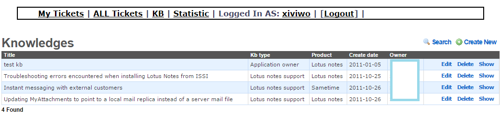

Ticket Tracking System
============
Record and tracking how one ticket is carried out, like time to get ticket, how much time spent on it, any solution or workaround for it, notes should be paid attention to.

##Basic Model

**User** - manage authentication and login. 

**Person** - for stakeholder involved in this system, who will accept ticket and resolve the ticket.

**Knowledge** -  the knowledge necessary for resolving this ticket and any useful information .

**Ticket** - modelling ticket we work on, with ticket number, customer ,details of the issue.

**Assignment** -  doing the assignment to decide who will take care of this ticket, with assign date, close date and status

**Note** -  to attach additional note/ comment about specific ticket.

##Screen Shot
###Ticket

###KB

###Statistic

##Specs
Powered by Ruby and Rails

##Notes
Old project, not guarantee to work under current Ruby and Rails environments,  migration under way.